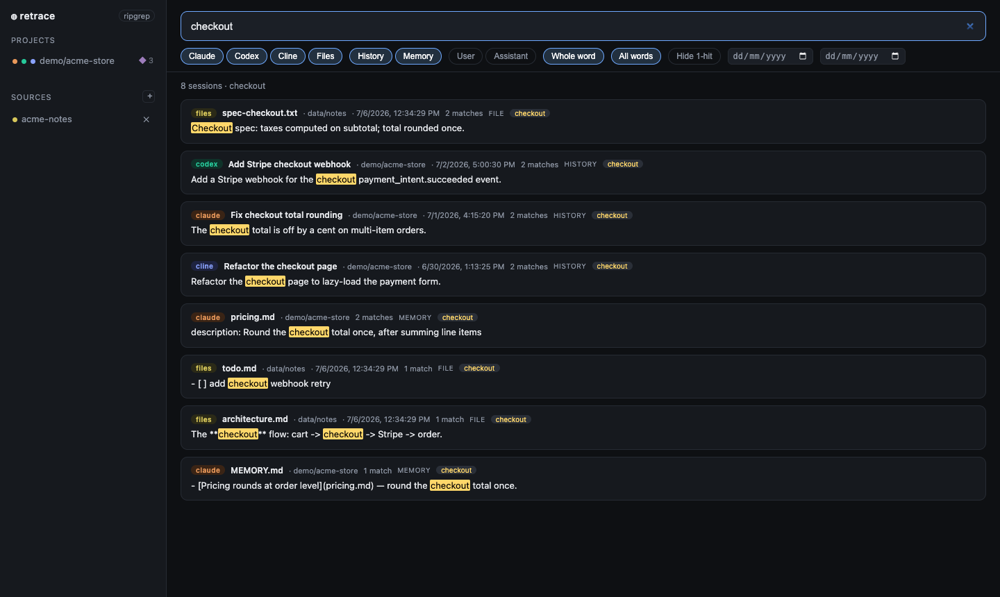

# retrace

**Search everything your AI coding agents ever did — and any local folder — in one place.**

`retrace` is a local, zero-dependency web app that unifies the session history of
**Claude Code**, **Codex**, and **Cline** (plus any folders you add) into one
search-first interface, grouped by the real project you were working in.



*(demo data — search `checkout` across all providers in a sample `acme-store` project)*

- 🔒 **Local & private** — reads files under your home dir, read-only. Nothing leaves your machine.
- ⚡ **Fast** — full-text search powered by [ripgrep](https://github.com/BurntSushi/ripgrep) (with a pure-Python fallback). No index to build, always fresh.
- 🧩 **Unified by project** — the same repo's history from different tools shows under one entry.
- 📁 **Beyond AI history** — add any local folder as a source and full-text search it too.
- 🪶 **Zero dependencies** — Python 3 standard library only. One command to run.

## Quickstart

```bash
git clone <your-repo-url> retrace && cd retrace
python3 server.py            # auto-picks a free port
# open the printed http://127.0.0.1:<port>
```

Or use the launcher (start / stop / restart):

```bash
./start.sh            # start on :8787
./start.sh stop
./start.sh restart
```

> **Tip (VS Code):** open the URL in the built-in Simple Browser
> (`⌘⇧P` → *Simple Browser: Show*) to keep it embedded in your editor.

### Try it with sample data (no real history needed)

```bash
python3 demo/seed_demo.py          # writes a fictional dataset to demo/data/
RETRACE_CLAUDE_DIR=demo/data/claude \
RETRACE_CODEX_DIR=demo/data/codex \
RETRACE_CLINE_DIR=demo/data/cline/data \
    python3 server.py --port 8788 --no-open
# then add demo/data/notes as a folder source in the UI and search "checkout"
```

The `RETRACE_*_DIR` env vars override where each provider is read from (handy for
testing, demos, or non-standard install locations).

## What it reads

| Source | Location | Notes |
|--------|----------|-------|
| Claude Code | `~/.claude/projects/**/*.jsonl` + `memory/` | transcripts + memory |
| Codex | `~/.codex/sessions/**/*.jsonl` | titles from `session_index.jsonl` |
| Cline | `~/.cline/data` | metadata in SQLite, transcripts in JSON |
| Custom folders | anything you add in the UI | full-text + filename search |

Missing tools are simply skipped — run it with whatever you have installed.

## Features

- **Search-first UI** — one box + filter chips: provider, source (history/memory), role, date.
- **Whole-word** matching (toggle off for substring) and **multi-keyword AND/OR**.
- **Grouped by session/file**, ranked by relevance; **Hide 1-hit** to drop incidental mentions.
- Click a result → full **transcript** (AI) or **file preview** (folders), with matches highlighted.
- **Add/remove folder sources** from the UI. Content is searched for text files; **all files are findable by name** (so `.docx`/`.xlsx`/`.pdf` show up by filename).

## Custom folder sources

Click **+** next to *Sources* in the sidebar and enter a folder path. Sources persist in
`sources.json` (git-ignored). Scans respect `.gitignore` and skip binaries.

**Note:** raw content search only works for text files (`.md`, `.txt`, `.csv`, `.json`, code, …).
Binary formats (`.docx`, `.xlsx`, `.pptx`, `.pdf`) are matched **by filename** only.

## Security

- The file-preview endpoint (`/api/file`) is **sandboxed**: it only serves files inside a
  configured source root (symlinks resolved, path traversal blocked).
- The server binds to `127.0.0.1` — local only.

## Requirements

- Python 3.9+
- Optional: [ripgrep](https://github.com/BurntSushi/ripgrep) (`brew install ripgrep`) for fastest
  search; without it, a pure-Python scanner is used automatically.

## How it works

A tiny stdlib `http.server` serves a single static page and a small JSON API. Each provider is an
**adapter** (`parser.py`, `codex.py`, `cline.py`, `sources.py`) that maps a tool's on-disk format
to a shared model; `search.py` orchestrates ripgrep across them and groups results by real project.
Adding a new tool = one adapter module.

## License

MIT — see [LICENSE](LICENSE).
